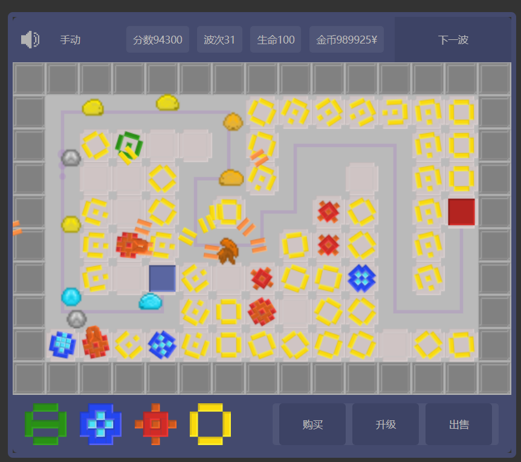

# 像素塔防（Pixel Tower Defense）

一款无尽模式的像素塔防小游戏。建造并升级不同类型的防御塔，抵御不断增强的怪物波次，打出更高的分数。基于https://github.com/ahrampy/tower-time
修改，把塔和攻击从png引用变成了canvas绘画，便于未来扩展更多的塔和攻击方式。

---

## 开始游戏
- 在浏览器打开 `home.html` 即可游玩（已内置资源与脚本）。
- 页面加载后游戏会自动开始：
  - 画布中随机生成一个起点（绿色箭头）与终点（红色旗帜）。
  - 地图边缘为不可通过的墙；内部会随机生成若干障碍块。
  - 顶部显示当前分数、波次、生命、金币；右侧有“第一波/下一波”按钮。

---

## 目标
- 阻止怪物从起点一路走到终点。
- 每有一只怪物抵达终点，你会损失 1 点生命；生命降至 0 游戏结束。
- 击杀怪物可获得金币与积分。尽可能坚持更久、拿到更高分数！

---

## 基本操作
- 鼠标移动：在画布上移动光标，若正在放置防御塔，可预览落点与射程圆圈。
- 鼠标单击（画布）：
  - 放置模式下：尝试在当前网格放置防御塔（若会堵死路径则会被拒绝并闪白）。
  - 非放置模式：选中当前网格上的防御塔（再次单击同一塔可取消选中）。
- 鼠标双击（画布）：对某个塔进行“同类同级全选”，便于批量升级或出售。
- 点击顶部“自动/手动”标签：切换波次自动派发开关。
- 点击右上“第一波/下一波”按钮：在手动模式下派发下一波怪物。
- 顶部左侧按钮：切换音乐开/关。

---

## 资源与经济
- 初始金币：1000000（便于自由尝试各塔搭配）。
- 击杀奖励：根据难度按比例增加。
- 每波结束发钱：每波结束会发放少量金币（与波次相关）。

---

## 防御塔
底部“塔牌”区域展示了 4 种塔。鼠标悬停可在右侧按钮上看到价格同步显示；点击塔牌或点“购买”进入放置模式。

- 基础塔（basic）
  - 价格：15，升级：30
  - 射程：100，冷却：1000ms
  - 伤害：30，弹速：8
  - 均衡型单体伤害，适合作为起步或补刀。

- 减速塔（slow）
  - 价格：30，升级：60
  - 射程：120，冷却：400ms
  - 伤害：10，弹速：1
  - 命中后使目标短暂“减速”，极大提升集火效率。

- 速射塔（fast）
  - 价格：50，升级：100
  - 射程：100，冷却：200ms
  - 伤害：20，弹速：10
  - 高频射击、稳定输出，清理小怪效率高。

- 群攻塔（all）
  - 价格：100，升级：200
  - 射程：150，冷却：1800ms
  - 伤害：100，弹速：16
  - 威力强大、冷却较长，适合关键路段的补强。

通用规则：
- 新塔放置会立即扣除价格。
- 升级：最多 2 次（等级 0→1→2）。每次升级：
  - 升级费用翻倍
  - 伤害大幅提升（约 ×2.5 后取整到 5 的倍数）
  - 射程 +25、弹速 +2
- 出售：返还“当前升级费用的一半”。
- 选择：
  - 单击塔可选中，再次单击取消。
  - 双击塔可“选中同类型且同等级的所有塔”。
- 选中后右下按钮可操作：
  - 升级：若可升级且金币充足，按钮会高亮并显示具体价格。
  - 出售：仅对已放置的塔可用。

---

## 放置与路径规则
- 塔必须放在空网格上，且不得封死怪物从起点到终点的唯一路径。
- 当你尝试放置：
  - 游戏会临时把该格设为占用，并重新计算从“终点”到各格子的距离值（广度优先）。
  - 若所有在场怪物仍可寻路，且起点也能连通终点，则放置成功；否则该格会闪白提示，放置被取消。
- 地图边界与初始障碍为固定墙，无法放置。

---

## 波次与怪物
- 点击“第一波/下一波”或开启自动模式，开始派怪。
- 每一波默认生成 20 个敌人，按 1.5 秒的间隔入场。
- 难度随波次提升：
  - 每 10 波、每 30 波额外提升一次全局难度系数。
- 敌人种类：
  - 史莱姆（Slime）：基础敌人，血量随波次增加。
  - 戈克（Gork）：精英敌人，血量更高。
  - 乌蜗（Uwo）：更强力的敌人，每 5 波的第一个单位可能是它。
- 被命中时：
  - 敌人会在所在格子上结算伤害；若命中为减速攻击，会短暂进入“减速”状态。
  - 敌人与墙或边界发生反弹时会短暂弹回（避免穿模）。
- 抵达终点：
  - 你损失 1 点生命，并有短暂的“生命数闪烁”提示。

---

## 界面说明
- 顶部栏（从左到右）：
  - 音乐按钮（开/关）
  - 自动/手动切换（点击文本切换）
  - 信息格：分数、波次、生命、金币
  - 右侧：波次按钮（第一波/下一波），带有进度条动画
- 底部栏：
  - 左侧：塔牌 4 个（悬停可在右下“购买”显示价格，点击进入放置）
  - 右侧：操作按钮（购买 / 升级 / 出售）

---

## 小技巧
- 先用“减速塔”建立减速区，再配合“速射塔/基础塔”集火，效益极高。
- 转角、路径拐点是放塔的黄金位置，单个塔可覆盖前后两段路。
- “群攻塔”适合在路径集中区作为战术补强，不必铺太多。
- 双击选择同类同级塔后，批量升级更省心。
- 若金币不足，相关按钮会闪烁提示，注意经济节奏。

---

## 常见问题（FAQ）
- Q：为什么有些位置无法放塔？
  - A：那会阻断怪物从起点到终点的路径，系统会自动拒绝并闪白提示。
- Q：自动模式与手动模式有什么区别？
  - A：自动模式会在清完一波后自动派发下一波；手动模式需要你点击“下一波”。
- Q：升级收益如何？
  - A：每次升级都有显著伤害提升，同时增加射程与弹速，性价比很高；但最多两次升级。
- Q：怎么重新开始？
  - A：在“游戏结束”画面点击“新游戏”按钮（若出现），或刷新页面。

---

## 运行与构建
- 直接双击 `home.html` 即可本地游玩（需支持 ES 模块的现代浏览器）。
- 若需使用打包资源：
  - `npm install`
  - `npm run build`
  - 启动静态服务器并访问 `home.html`（构建产物在 `dist/`）。

---

祝你好运，守住最后的防线！
